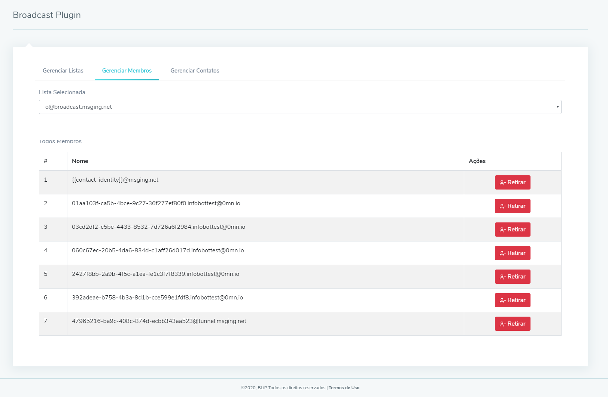
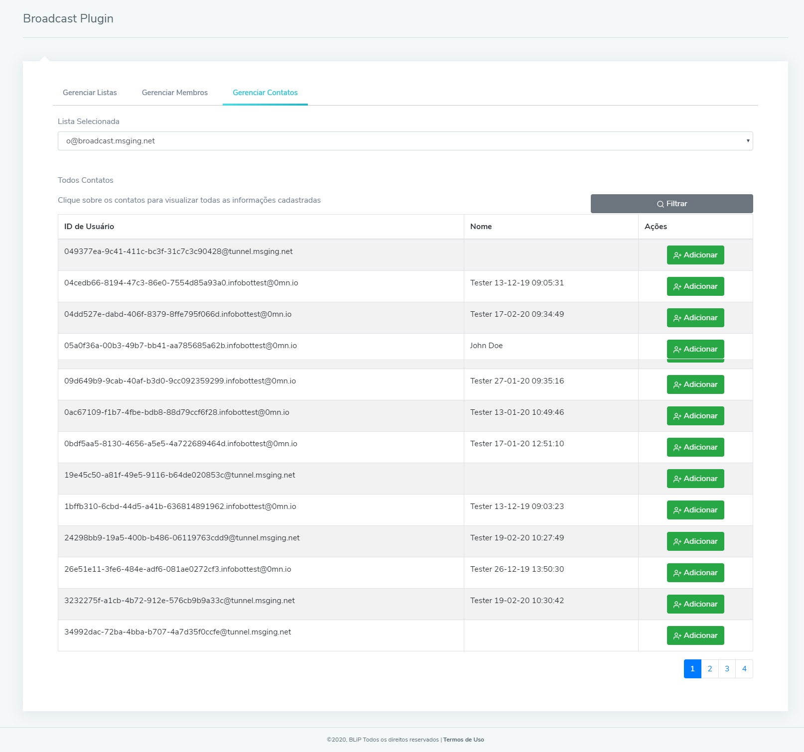
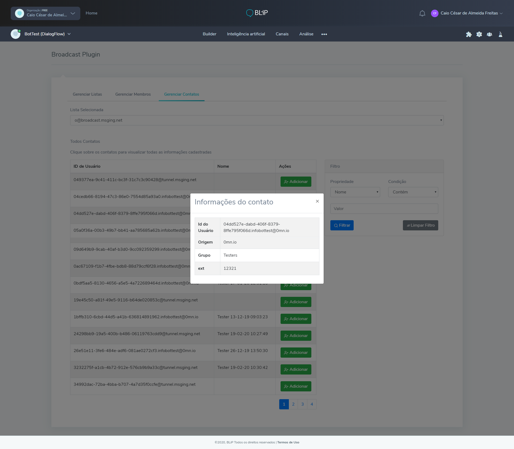
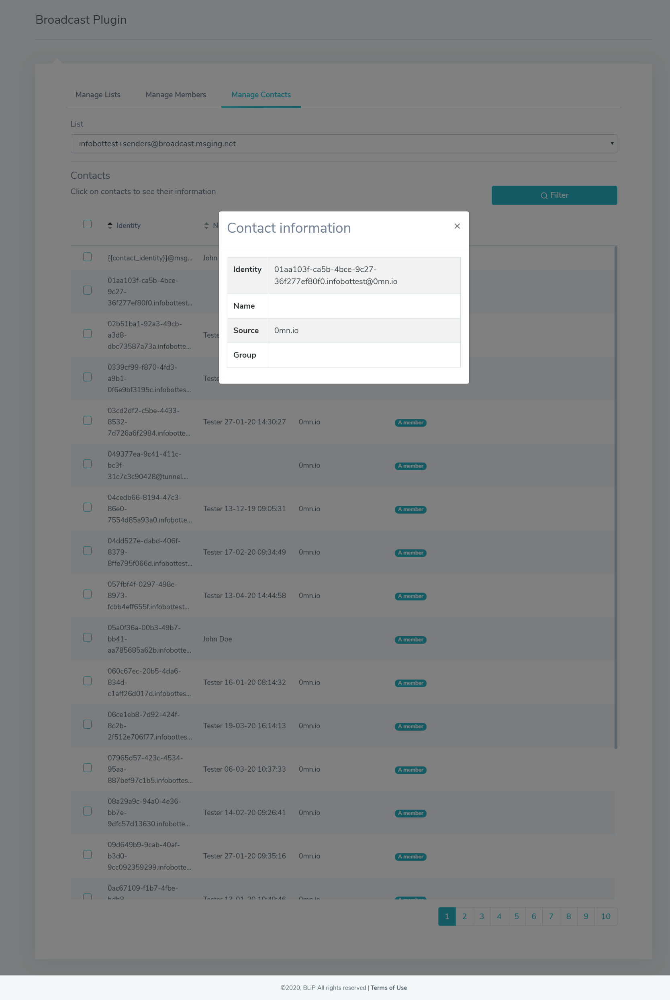
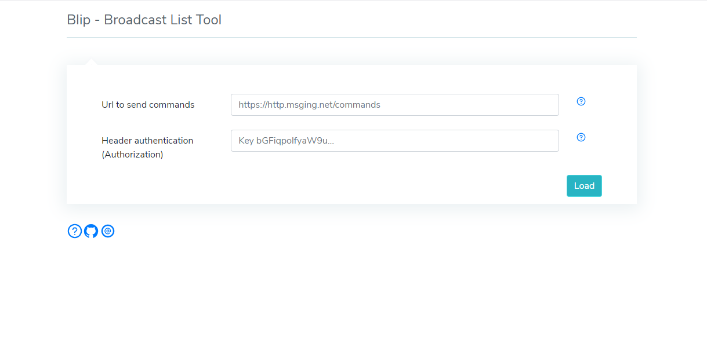

# BLiP Broadcast Plugin/Tool

This is a BLiP example plugin/tool made to help users manage distribution lists with ease.

Visit the sample [page here](https://blip-broadcast-plugin.netlify.app).

## What is possible to do with this plugin/tool

### Distribution Lists

1.  See all the distribution lists of the bot.
2.  Add new lists.


3.  Delete list.



### Members

1.  See all the members' distribution list.
2.  Remove a member from a distribution list.



### Contacts

1.  See all the contacts' bot.
2.  Add contacts into the selected distribution list.


3.  Filter all the contacts' bot by:

- Name
- Email
- Phone
- City
- Id
- Extras



4.  See all contact information.
    

## Connecting the plugin to your bot

1. Access your bot's advanced configuration.
2. Set the follow tuple:  
   **Domain**: `postmaster@portal.blip.ai`  
   **Key**: `Plugins`  
   **Value**:

```json
{
  "broadcast-list-plugin": {
    "name": "Broadcast List Plugin",
    "url": "https://blip-broadcast-plugin.netlify.app"
  }
}
```

See the result below:


3. Access the following path shown below to use the plugin:


## Using the project as a Tool

1. Access the [url project](https://blip-broadcast-plugin.netlify.app)
   
1. Fill in the fields key with your bot information, you can find this information following the image bellow:
   
1. Click on load button.

## Getting started from this project

1. Download or clone the project from `git`(the recommended way):

`git clone https://github.com/takenet/blip-plugin-sample.git`

2. Install all packages from npm:

`npm install`

3. Run the project:

`npm start`

4. Now just add the plugin to your chatbot and enjoy!
