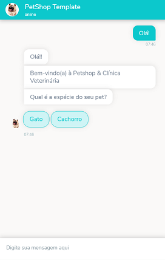
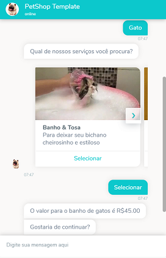
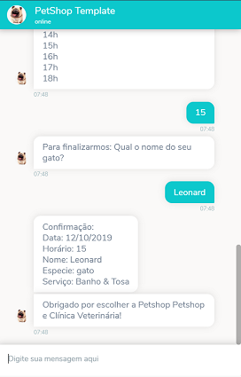
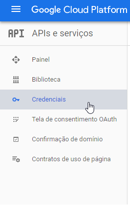
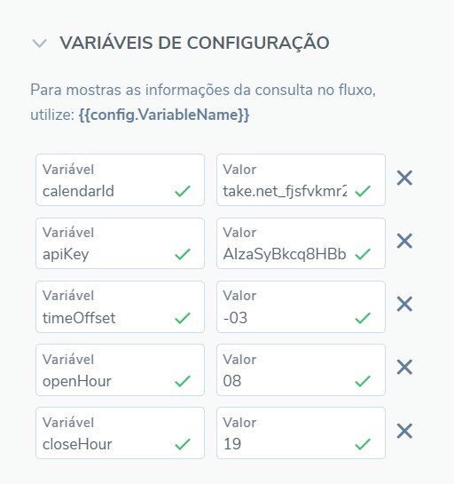

# Petshop Template

Esse chatbot foi feito para ajudar Petshops a oferecerem seus serviços e uma maneira de agendá-los, integrando automaticamente com o "Google Calendar".

##### O que pode ser feito:
* Exibir seus serviços
* Prover informações sobre o Petshop
* Fornecer ao cliente opção de marcar um horário em sua agenda automaticamente, de acordo com seus horários livres.
* Coletar informações do cliente.

## Exemplo de uso

 
 


## Pré requisitos
* Uma conta do Google
* Uma agenda no Google Calendar
* Um projeto no Google Cloud Platform
* Dar permissão para que o bot acesse, edite e escreva em sua agenda.

## Como usar
Para começar a utilizar o bot, é preciso configurar sua conta no Google, fazer a autenticação e informar para qual agenda os eventos serão enviados.
1. [Baixe o fluxo do bot](https://github.com/takenet/blip-tools/blob/master/Templates/Petshop%20template%20(scheduling)/petShop_template.json)
2. Crie um novo bot e importe o fluxo para ele
3. Crie uma conta no Google.
4. Nessa conta, crie um Agenda no [Google Calendar](https://calendar.google.com), e pegue o seu ID
       2.1 Acesse a agenda, clique em **Opções**
       
       2.2 Procure pelo **Id da Agenda** e copie-o.
5. No bot, crie uma variável de configuração chamada **calendarId** e coloque como valor o Id da Agenda que você acabou de copiar.
6. Crie um projeto no **[Google Cloud Platform](https://console.cloud.google.com/)**
7. Com o projeto criado, acesse a área **APIs e Serviços** e clique em **Credenciais**.
<br>

6. Selecione "Criar credenciais" e crie uma  **Chave de Api**. Copie o valor informado.
7. Crie uma variável de configuração chamada **apiKey** e coloque o valor copiado no passo 6.
8. Selecione "Criar credenciais" novamente, desta vez optando por criar um **Id do cliente Oauth**
    8.1. Selecione **Aplicativo Web**
    8.2. Informe um nome
9. Ao final, copie o **Id do cliente** e a **chave secreta do cliente**
10. Entre no **[OAuth 2.0 Playground](https://developers.google.com/oauthplayground/)**
11. Procure por **Calendar API V3** na lista de APIs. Selecione todos os escopos disponíveis para ela e clique em **Authorize APIs**
12. Será solicitado que você faça *login* e dê permissão.
13. Ainda no Playground, abra o menu de configurações e selecione a opção **Use your own OAuth credentials**. Nos campos correspondentes, informe o **Id do cliente** e a **chave secreta do cliente**.
14. Clique em **Exchange authorization code for tokens** para gerar os valores de *Refresh Token*.
15. Copie os valores de **Refresh Token** e **Access Token** e salve.
16. No seu bot, crie uma **Ação global de entrada** uma requisição HTTP.
17. Preencha as informações conforme abaixo:

```http
Método: POST
URL: https://accounts.google.com/o/oauth2/token
```
18. O corpo da requisição deverá ser como a seguir, onde você deverá informar os valores salvos.

```javascript
{
    "client_secret": "YOUR_CLIENT_SECRET",
    "grant_type": "refresh_token",
    "refresh_token": "YOUR_REFRESH_TOKEN",  
    "client_id": "YOUR_CLIENT_ID"
}
```

1.  Crie uma variável de configuração chamada **timeOffset** e informe a diferença entre seu fuso-horário e UTC-0. *Para o horário de Brasília, informe **-3**.*
2.  Crie duas variáveis de configuração:
    20.1 **openHour** informando a hora que seu petshop abre (apenas a hora, no formato HH);
    20.2 **closeHour** informando a hora que seu petshop fecha.


